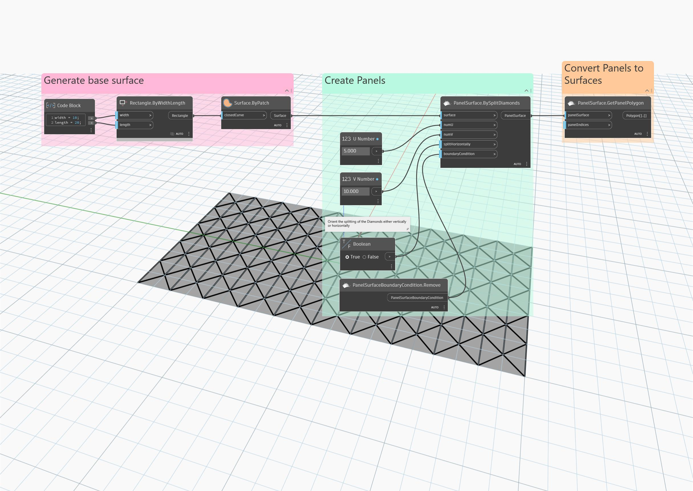

## Im Detail
Ordnet die Eingabeoberfläche in einem rautenförmigen Muster an, wobei jede Raute vertikal oder horizontal in zwei Dreiecke geteilt wird. Vorgabemäßig wird jede Raute vertikal geteilt.
___
## Beispieldatei

