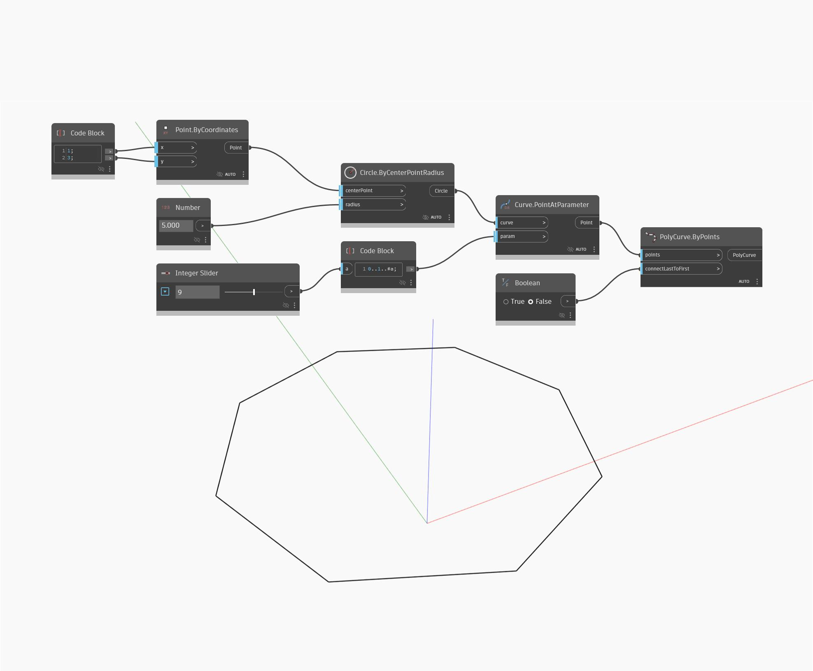

## Im Detail
`PolyCurve.ByPoints` erstellt verbundene Kurven aus einem Satz von Scheitelpunkten. Dieser Block ermöglicht außerdem das Wechseln zwischen einer geschlossenen und einer offenen Form mit der `connectLastToFirst`-Eingabe.

Im folgenden Beispiel werden Punkte entlang eines Kreises erstellt und mit einem `PolyCurve.ByPoints`-Block neu gezeichnet, wodurch eine geschlossene Polygonform entsteht.

___
## Beispieldatei

