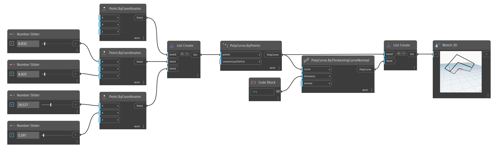

## Im Detail
PolyCurve.ByThickeningCurveNormal erstellt eine PolyCurve durch Verdicken einer bestimmten Kurve entlang einer Ebene, die durch die eingegebene Normale angegeben wird. Dieser Block erstellt beispielsweise eine Begrenzung auf jeder Seite der Eingabekurve und versetzt diese.
___
## Beispieldatei

