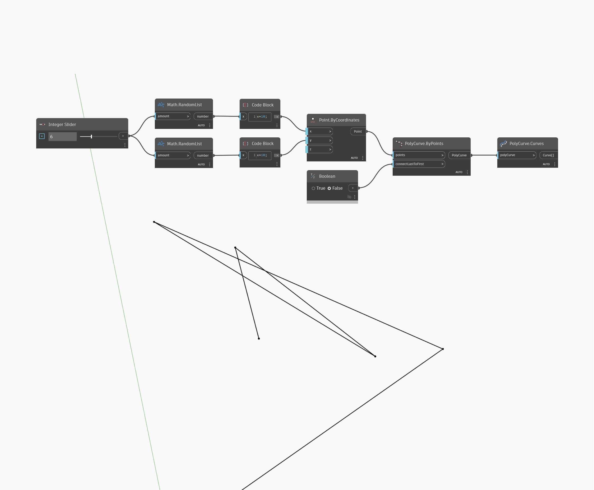

## Im Detail
`PolyCurve.Curves` gibt eine Liste der einzelnen Kurven zurück, aus denen ein eingegebenes PolyCurve-Objekt besteht.

Im folgenden Beispiel wird ein Satz zufälliger Punkte generiert und mithilfe von `PolyCurve.ByPoints` ein offenes PolyCurve-Objekt erstellt. Anschließend generieren wir mit `PolyCurve.Curves` eine Liste der einzelnen Kurven, aus denen das PolyCurve-Objekt besteht.

___
## Beispieldatei

