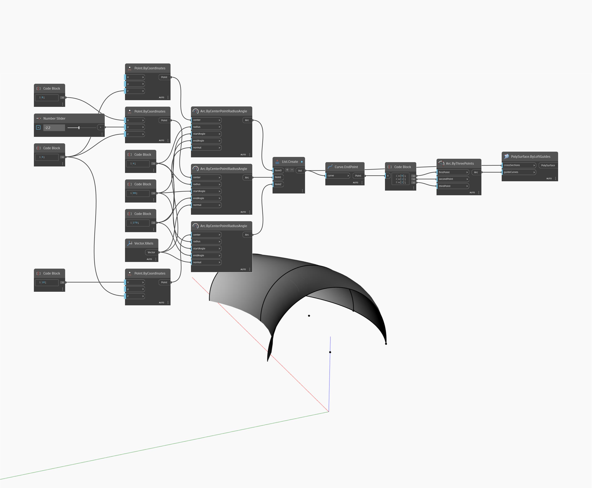

## Im Detail
ByLoftGuides gibt eine PolySurface durch Erhebung durch eine Liste von PolyCurves (crossSections) zurück. Im folgenden Beispiel wird eine PolySurface durch Erhebung durch drei Bogen und ein guideCurve-Objekt für einen Bogen erstellt. Die Bogen geben der Erhebung ihren Querschnitt, und das guideCurve-Objekt gibt der Erhebung eine zu verfolgende Führungslinie.
___
## Beispieldatei

