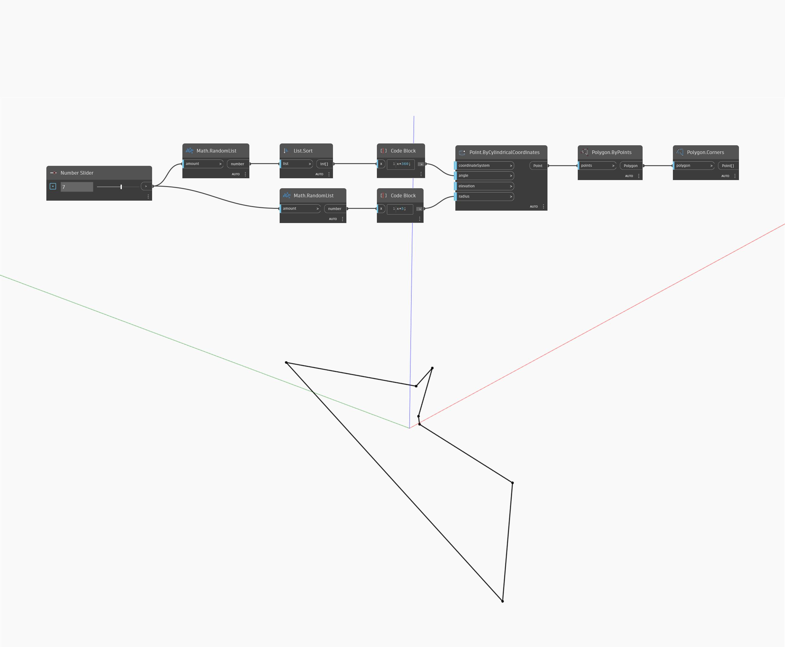

## Im Detail
Corners gibt eine Liste mit Punkten zurück, die die Ecken des angegebenen Polygons darstellen. Im folgenden Beispiel wird zunächst ein Satz zufälliger Punkte generiert, die nach Winkel sortiert werden, um sie mit Polygon By Points zu verwenden. Sie können die Punkte wieder als Liste abrufen, indem Sie Corners verwenden.
___
## Beispieldatei

