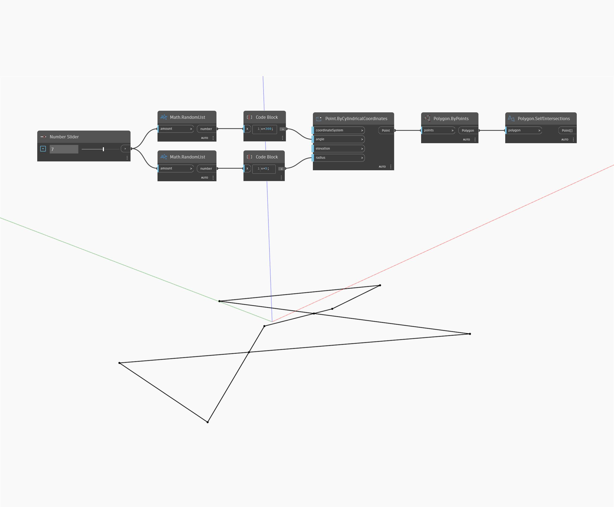

## Im Detail
Self Intersections gibt eine Liste aller Punkte zurück, an denen sich ein Polygon selbst schneidet. Im folgenden Beispiel erstellen Sie zunächst eine Liste zufälliger unsortierter Winkel und Radien, die für Points By Cylindrical Coordinates verwendet werden. Da die Höhe konstant gehalten und die Winkel dieser Punkte nicht sortiert wurden, ist ein mit Polygon By Points erstelltes Polygon planar und schneidet sich wahrscheinlich selbst. Anschließend können Sie die Schnittpunkte mithilfe von Self Intersections ermitteln
___
## Beispieldatei

