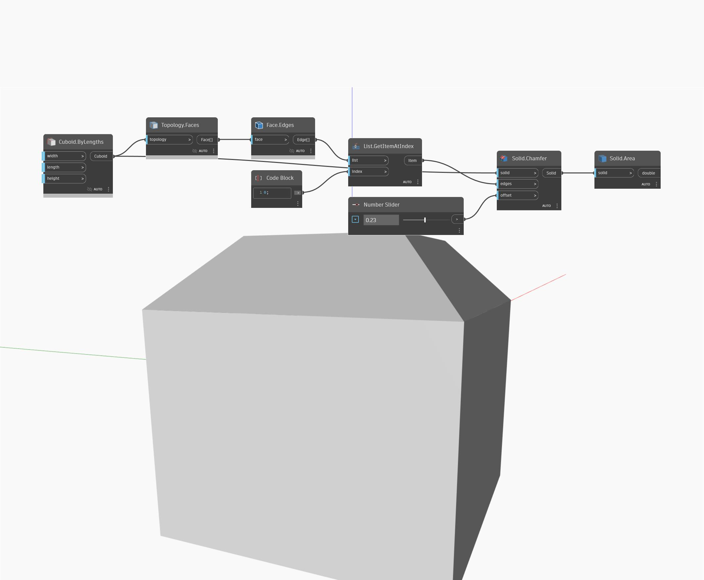

## Im Detail
`Solid.Area` gibt den Oberflächenbereich eines bestimmten Volumenkörpers zurück.

Im folgenden Beispiel beginnen wir mit einem Würfel und fasen dann die Kanten, um einen neuen Volumenkörper zu erstellen. Wir verwenden `Solid.Area`, um die Gesamtfläche aller Oberflächen dieses Volumenkörpers zu ermitteln.

___
## Beispieldatei

