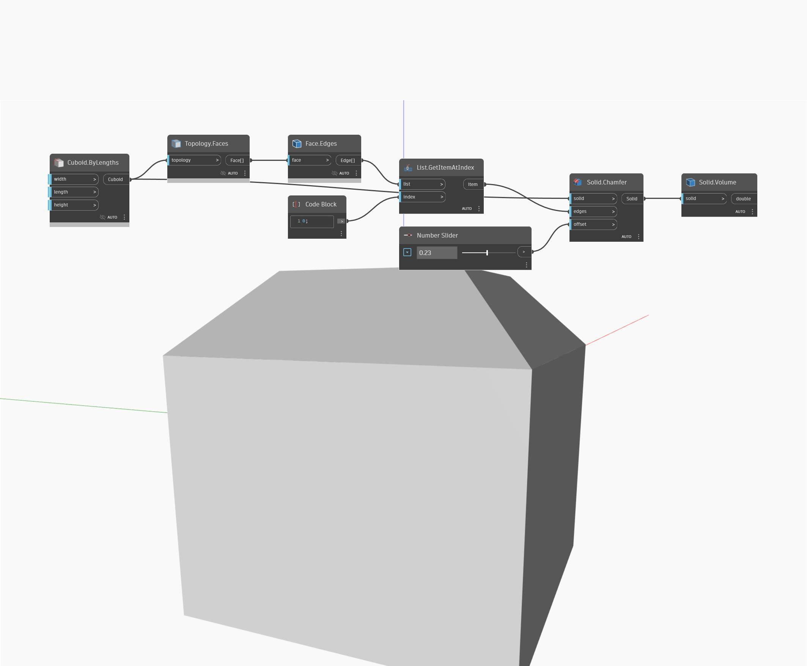

## Im Detail
Volume gibt das Volumen eines bestimmten Volumenkörpers zurück. Im folgenden Beispiel beginnen Sie mit einem Würfel und fasen dann die Kanten, um einen neuen Volumenkörper zu erstellen. Sie können Volume verwenden, um das neue Volumen dieses Volumenkörpers zu ermitteln.
___
## Beispieldatei

