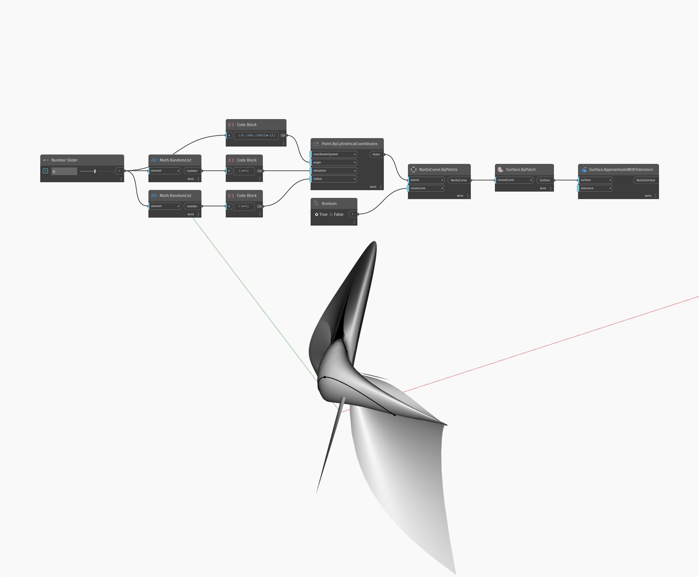

## Im Detail
Approximate with Tolerance erstellt eine NURBS-Oberfläche, die einer eingegebenen Oberfläche ähnelt. Die Toleranzeingabe bestimmt, wie genau das Ergebnis mit der ursprünglichen Oberfläche übereinstimmt. Im folgenden Beispiel erstellen Sie eine Oberfläche mit einem ByPatch-Block und einer geschlossenen NURBS-Kurve als Eingabe. Beachten Sie, dass das Ergebnis eine ungestutzte NURBS-Oberfläche mit vier Seiten ist, wenn Sie diese Oberfläche als Eingabe für einen ApproximateWithTolerance-Block verwenden.
___
## Beispieldatei

