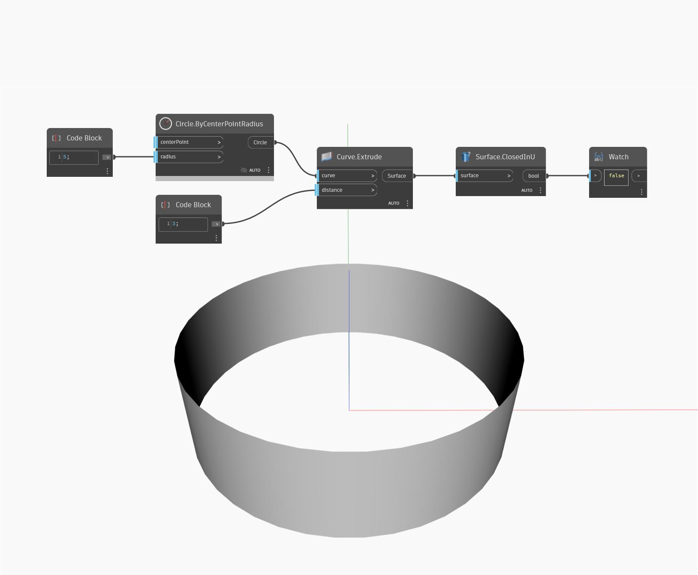

## Im Detail
ClosedInU gibt einen booleschen Wert zurück, der davon abhängt, ob eine Oberfläche in U-Richtung geschlossen ist. Im folgenden Beispiel gibt ein extrudierter Kreis, der in eine Richtung geschlossen ist, False zurück, da er in U nicht geschlossen ist.
___
## Beispieldatei

