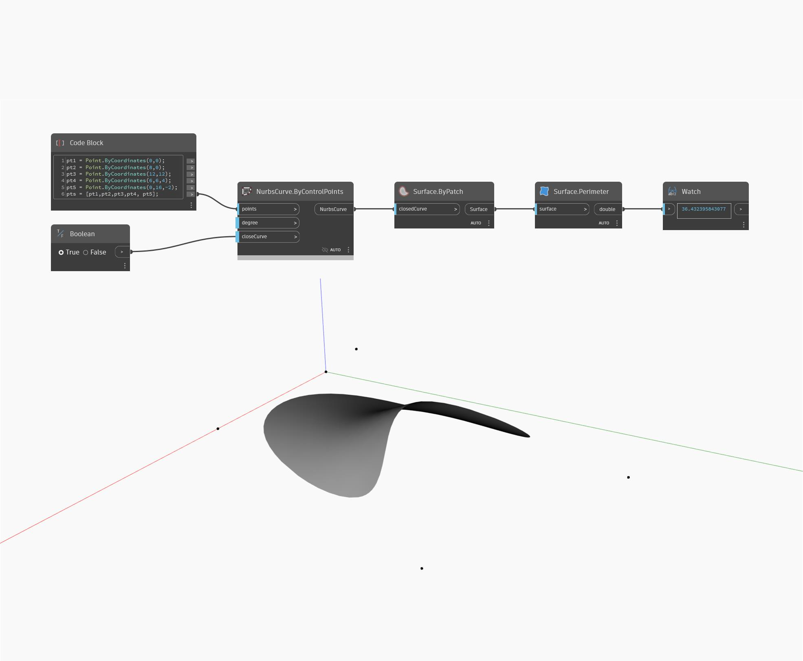

## Im Detail
Perimeter gibt die Länge des Umfangs einer Oberfläche als double-Wert zurück. Im folgenden Beispiel gibt der Umfang einer komplexen NurbsSurface den Wert 36.432 zurück.
___
## Beispieldatei

