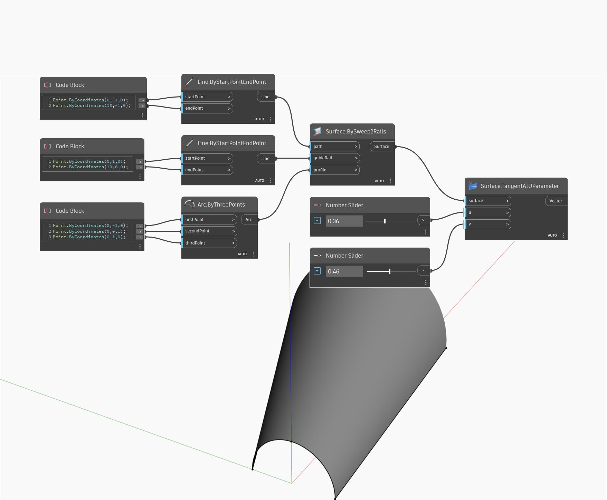

## Im Detail
Tangent at U Parameter gibt den Tangentenvektor in U-Richtung an einer angegebenen UV-Position auf einer Oberfläche zurück. Im folgenden Beispiel erstellen Sie zunächst eine Oberfläche mit BySweep2Rails. Anschließend ermitteln Sie mit zwei Zahlen-Schiebereglern die U- und V-Parameter, um den U-Tangentenvektor zu finden.
___
## Beispieldatei

