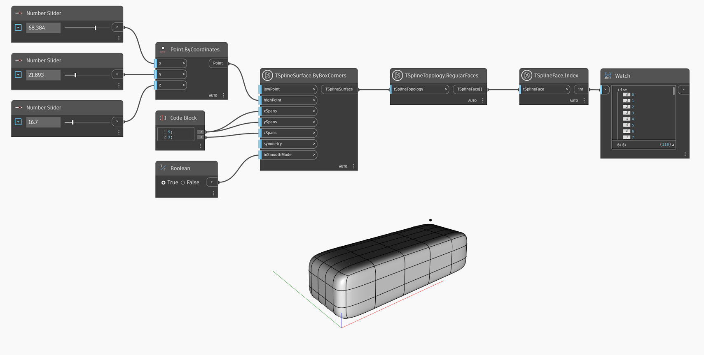

## In-Depth
`TSplineFace.Index` gibt den Index der Fläche auf der T-Spline-Oberfläche zurück. Beachten Sie, dass in einer T-Spline-Oberflächentopologie die Indizes für Fläche, Kante und Scheitelpunkt nicht unbedingt mit der Sequenznummer des Elements in der Liste übereinstimmen. Verwenden Sie zur Behebung dieses Problems den Block `TSplineSurface.CompressIndices`.

Im folgenden Beispiel wird `TSplineFace.Index` verwendet, um die Indizes aller regulären Flächen einer T-Spline-Oberfläche anzuzeigen.

## Beispieldatei

