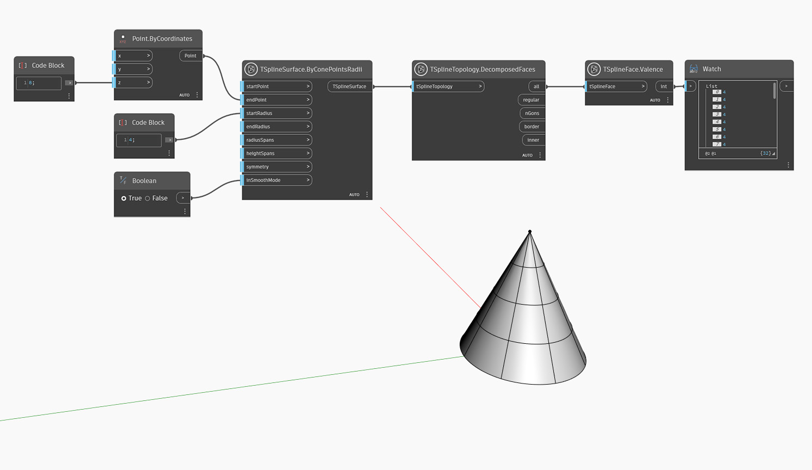

## In-Depth
Im folgenden Beispiel wird `TSplineFace.Valence` verwendet, um die Wertigkeit aller Flächen eines T-Spline-Kegelgrundkörpers abzufragen. Beachten Sie, dass alle Flächen, einschließlich der oberen Reihe des Kegels, den Wertigkeitswert 4 zurückgeben, auch wenn es den Anschein hat, dass die obere Reihe aus Dreiecken besteht. Dies ist für einige T-Spline-Grundkörperformen wie Kegel und Kugel spezifisch, bei denen zwei von vier Scheitelpunkten an einem Punkt gestapelt werden, um die Form zu erzielen.

## Beispieldatei

