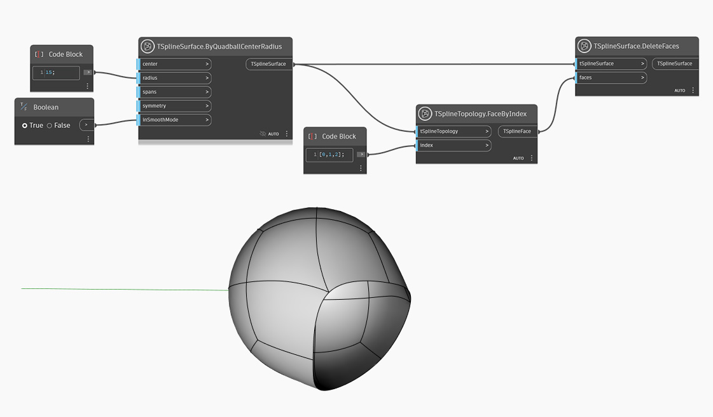

## Im Detail

Im folgenden Beispiel wird mit dem Block `TSplineSurface.ByQuadballCenterRadius` eine Quadball-Grundkörper-T-Spline-Oberfläche erstellt. Ein Satz von Flächen wird mit dem Block `TSplineTopology.FaceByIndex` ausgewählt und als Eingabe für den Block `TSplineSurface.DeleteFaces` bereitgestellt.

## Beispieldatei

