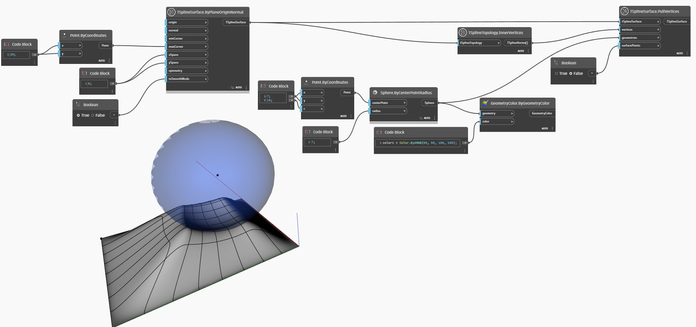

## Im Detail
Im folgenden Beispiel werden alle inneren Scheitelpunkte einer T-Spline-Ebenenoberfläche mit dem Block `TSplineTopology.InnerVertices` erfasst. Die Scheitelpunkte werden zusammen mit der Oberfläche, zu der sie gehören, als Eingabe für den Block `TSplineSurface.PullVertices` verwendet. Die Eingabe `geometry` ist eine Kugel oberhalb der Ebenenoberfläche. Die Eingabe `surfacePoints` ist auf False gesetzt. Steuerpunkte werden zum Durchführen des Ziehvorgangs verwendet.
___
## Beispieldatei

