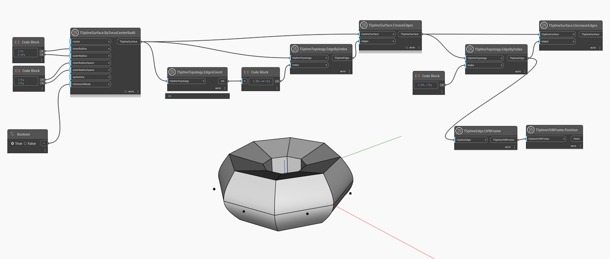

## In-Depth
Anders als der Block `TSplineSurface.CreaseEdges` entfernt dieser Block den Knick der angegebenen Kante auf einer T-Spline-Oberfläche.
Im folgenden Beispiel wird eine T-Spline-Oberfläche aus einem T-Spline-Torus erstellt. Alle Kanten werden mithilfe der Blöcke `TSplineTopology.EdgeByIndex` und `TSplineTopology.EdgesCount` ausgewählt, und Knicke werden mithilfe des Blocks `TSplineSurface.CreaseEdges` auf alle Kanten angewendet. Ein Teil der Kanten mit Indizes von 0 bis 7 wird dann ausgewählt, und der umgekehrte Vorgang wird angewendet. Diesmal wird der Block `TSplineSurface.UncreaseEdges` verwendet. Eine Vorschau der Position der ausgewählten Kanten wird mithilfe der Blöcke `TSplineEdge.UVNFrame` und `TSplineUVNFrame.Poision` angezeigt.

## Beispieldatei

