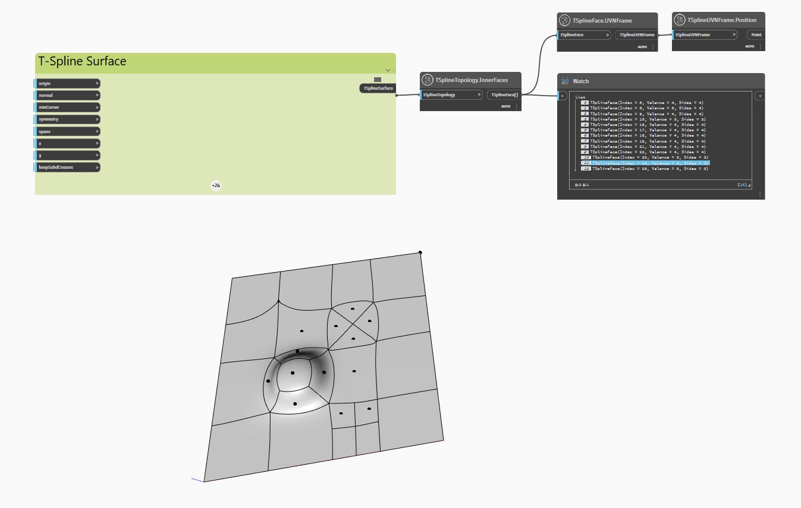

## Im Detail
Im folgenden Beispiel wird eine planare T-Spline-Oberfläche mit extrudierten, unterteilten und gezogenen Scheitelpunkten und Flächen mit dem Block `TSplineTopology.InnerFaces` überprüft.

Die Blöcke `TSplineFace.UVNFrame` und `TSplineUVNFrame.Position` werden verwendet, um den Mittelpunkt der Innenflächen der Oberfläche hervorzuheben.
___
## Beispieldatei

