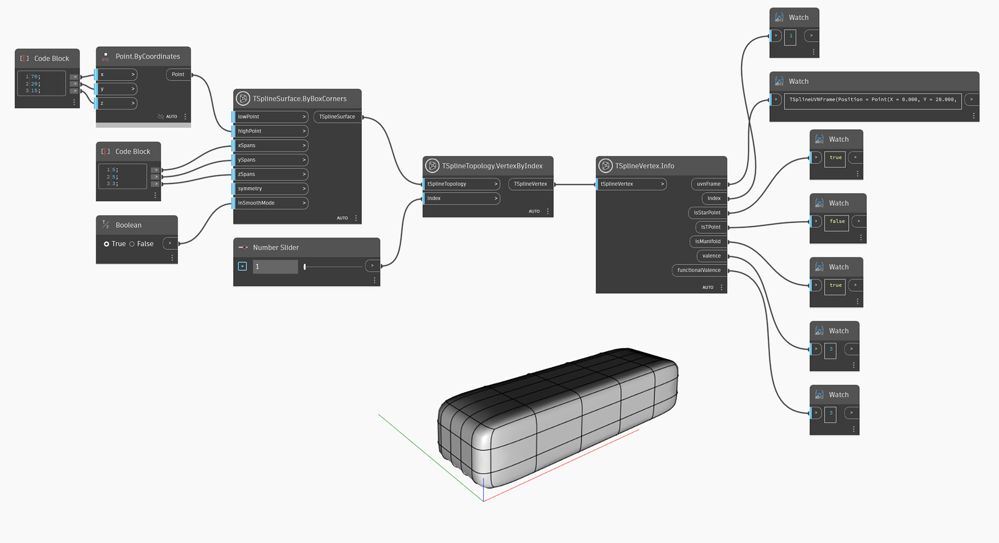

## In-Depth
`TSplineVertex.Info` gibt die folgenden Eigenschaften eines T-Spline-Scheitelpunkts zurück:
- `uvnFrame`: Punkt auf der Hülle, dem U-Vektor, dem V-Vektor und dem Normalenvektor des T-Spline-Scheitelpunkts
- `index`: Index des ausgewählten Scheitelpunkts auf der T-Spline-Oberfläche
- `isStarPoint`: Angabe, ob der ausgewählte Scheitelpunkt ein Sternpunkt ist
- `isTpoint`: Angabe, ob der ausgewählte Scheitelpunkt ein T-Punkt ist
- `isManifold`: Angabe, ob der ausgewählte Scheitelpunkt mannigfaltig ist
- `valence`: Anzahl der Kanten auf dem ausgewählten T-Spline-Scheitelpunkt
- `functionalValence`: Die funktionale Wertigkeit eines Scheitelpunkts. Weitere Informationen finden Sie in der Dokumentation für den Block `TSplineVertex.FunctionalValence`.

Im folgenden Beispiel werden `TSplineSurface.ByBoxCorners` und `TSplineTopology.VertexByIndex` verwendet, um eine T-Spline-Oberfläche zu erstellen und die Scheitelpunkte auszuwählen. `TSplineVertex.Info` wird verwendet, um die oben genannten Informationen über einen ausgewählten Scheitelpunkt zu erfassen.

## Beispieldatei

