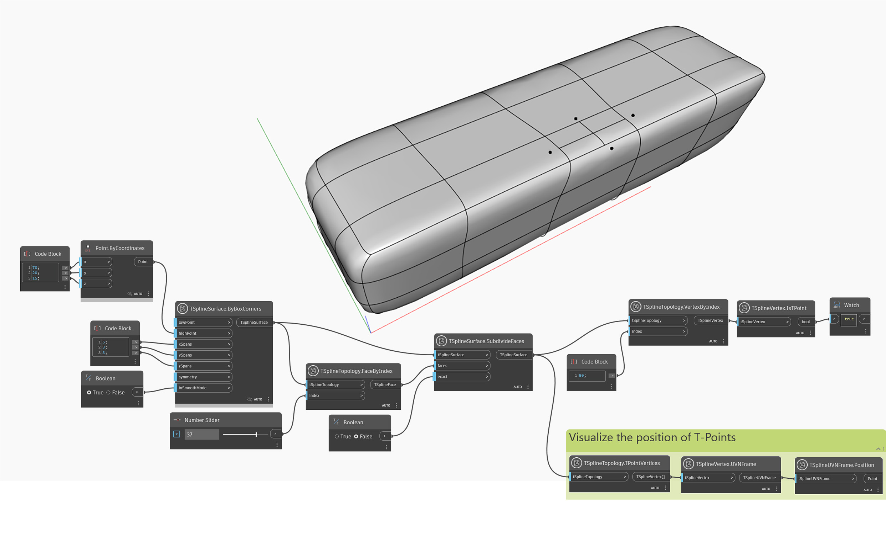

## In-Depth
`TSplineVertex.IsTPoint` gibt die Information zurück, ob ein Scheitelpunkt ein T-Punkt ist. T-Punkte sind Scheitelpunkte am Ende der Teilzeilen von Steuerpunkten.

Im folgenden Beispiel wird `TSplineSurface.SubdivideFaces` auf einem T-Spline-Quadergrundkörper verwendet, um eine der verschiedenen Methoden zum Hinzufügen von T-Punkten zu einer Oberfläche zu veranschaulichen. Der Block `TSplineVertex.IsTPoint` wird verwendet, um zu bestätigen, dass ein Scheitelpunkt an einem Index ein T-Punkt ist. Zur besseren Visualisierung der Position von T-Punkten werden die Blöcke `TSplineVertex.UVNFrame` und `TSplineUVNFrame.Position` verwendet.

## Beispieldatei

