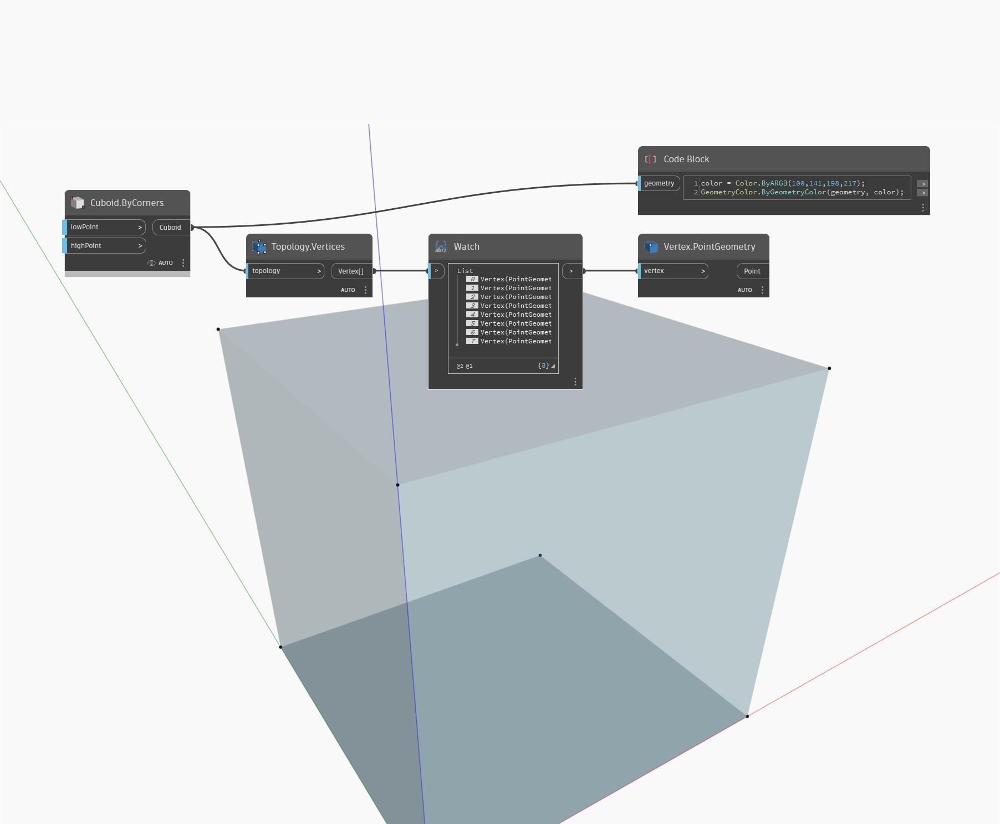

## Im Detail
Vertices gibt eine Liste der Scheitelpunktpositionen für eine Eingabegeometrie zurück. Im folgenden Beispiel gibt der Quader eine Liste mit 8 Scheitelpunktpositionen zurück.
___
## Beispieldatei

