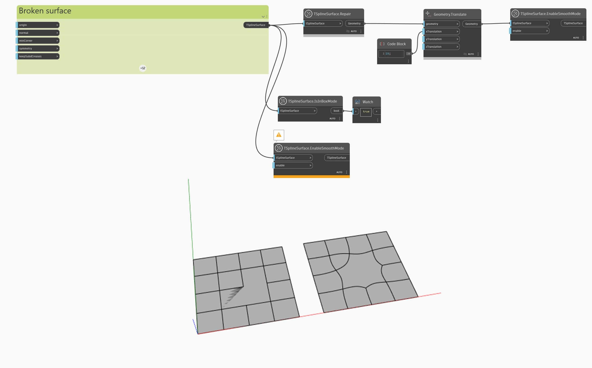

## Im Detail
Im folgenden Beispiel wird eine T-Spline-Oberfläche ungültig. Dies kann durch überlappende Flächen in der Hintergrundvorschau erkannt werden. Die Ungültigkeit der Oberfläche kann durch Fehler beim Aktivieren des Modus Glatt mithilfe des Blocks `TSplineSurface.EnableSmoothMode` bestätigt werden. Ein weiterer Hinweis ist der Block `TSplineSurface.IsInBoxMode`, der `true` zurückgibt, auch wenn für die Oberfläche anfangs der Modus Glatt aktiviert war.

Um die Oberfläche zu reparieren, wird sie durch einen `TSplineSurface.Repair`-Block geleitet. Das Ergebnis ist eine gültige Oberfläche, was durch das erfolgreiche Aktivieren des glatten Vorschaumodus bestätigt werden kann.
___
## Beispieldatei

