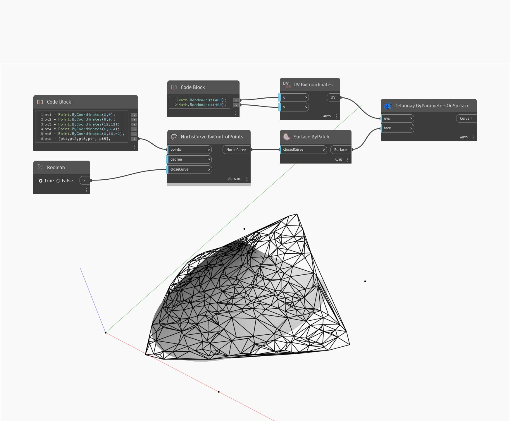

## Im Detail
`UV.ByCoordinates` gibt einen UV aus zwei Listen von double-Werten zurück. U und V sind die horizontalen bzw. vertikalen Koordinaten, die definieren, wie 2D-Texturen auf eine 3D-Oberfläche angewendet werden.

Im folgenden Beispiel wird ein UV von 400 zufälligen Werten zurückgegeben, um eine Delaunay-Triangulation eines NurbsSurface-Objekts zu erstellen.

___
## Beispieldatei

