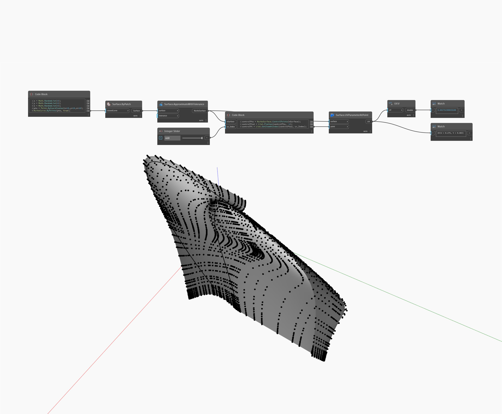

## Im Detail
V gibt den V-Wert einer UV-Koordinate zurück. Im folgenden Beispiel wird der V-Wert einer Punktposition auf der NurbsSurface zurückgegeben. Der UV-Parameter wird vom Surface.UVParamterAtPoint-Block zurückgegeben.
___
## Beispieldatei

