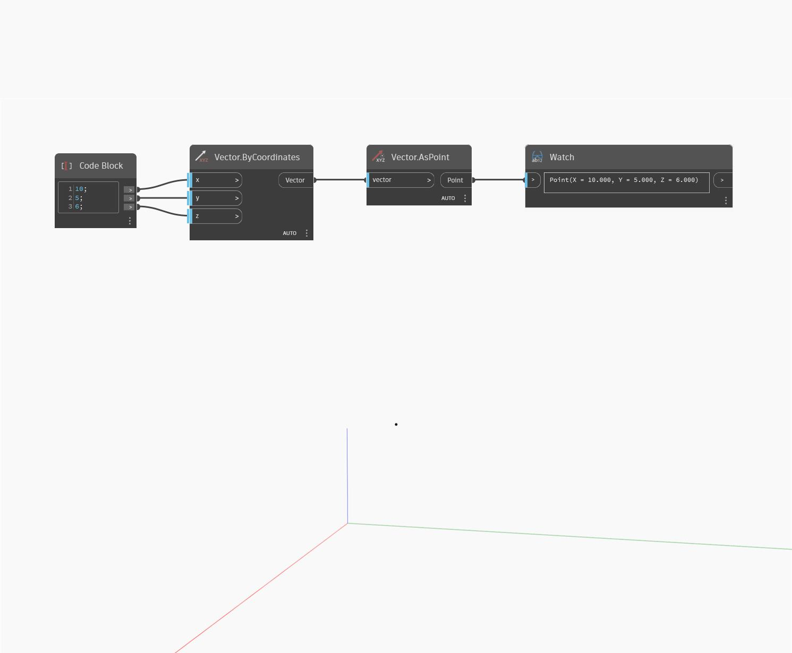

## Im Detail
AsPoint gibt einen Punkt an den Koordinatenwerten eines Vektors zurück. Im folgenden Beispiel wird vom Vector.ByCoordinates-Block ein Punkt (10,5,6) zurückgegeben.
___
## Beispieldatei

