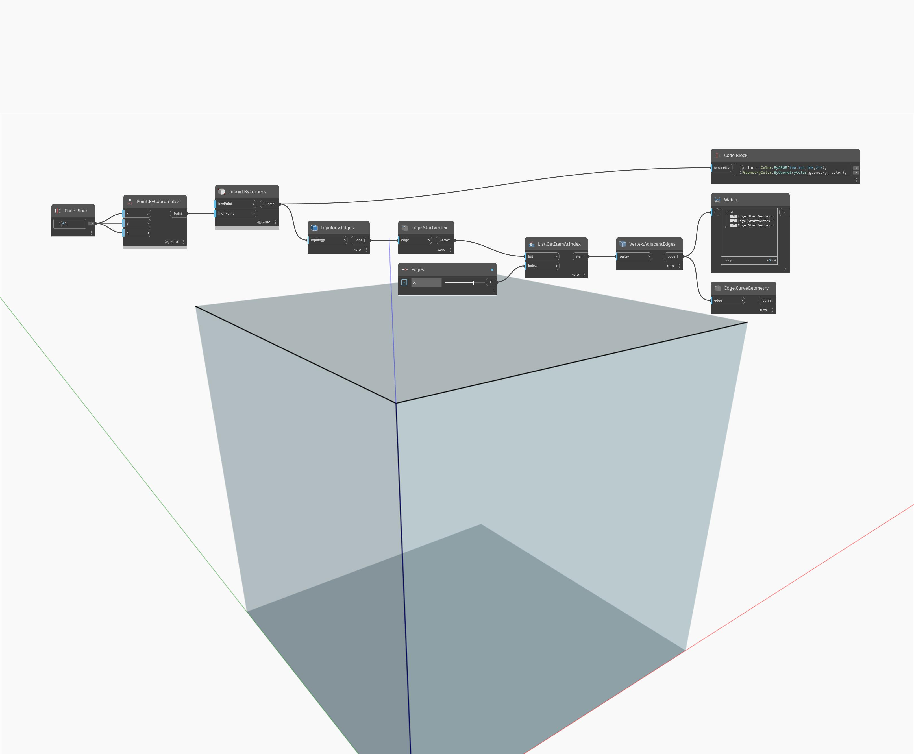

## Im Detail
AdjacentEdges gibt die Kanten zurück, die von einem Scheitelpunkt ausgehen. Im folgenden Beispiel werden die von einem Scheitelpunkt auf einem Würfel ausgehenden Kanten als Linien dargestellt. Passen Sie den Schieberegler für Kanten an, um verschiedene Sätze angrenzender Kanten zurückzugeben.
___
## Beispieldatei

