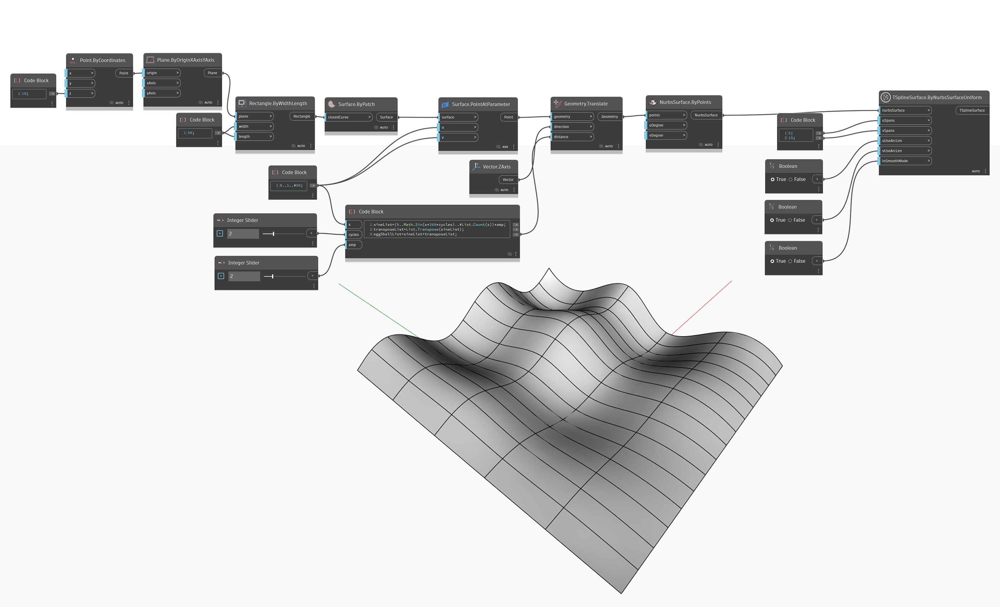

<!--- Autodesk.DesignScript.Geometry.TSpline.TSplineSurface.ByNurbsSurfaceUniform --->
<!--- C4KTVIQMR24V34QUQQ3FENYOOIOHKLUQ3SSJL3SVKQ2Z4QHWN4ZQ --->
## Im Detail
Im folgenden Beispiel wird eine NURBS-Oberfläche des Grads 3 mithilfe des Blocks `TSplineSurface.ByNurbsSurfaceUniform` in eine T-Spline-Oberfläche konvertiert. Die eingegebene NURBS-Oberfläche wird mit gleichmäßigen Knoten neu erstellt, die abhängig von den entsprechenden Eingaben `uUseArcLen` und `vUseArcLen` in gleichen parametrischen oder Bogenlängenintervallen platziert werden, und um die NURBS-Oberfläche des Grads 3 angenähert. Der ausgegebene T-Spline wird durch die angegebene Anzahl der Werte `uSpan` und `vSpan` in U- und V-Richtung geteilt.

## Beispieldatei

