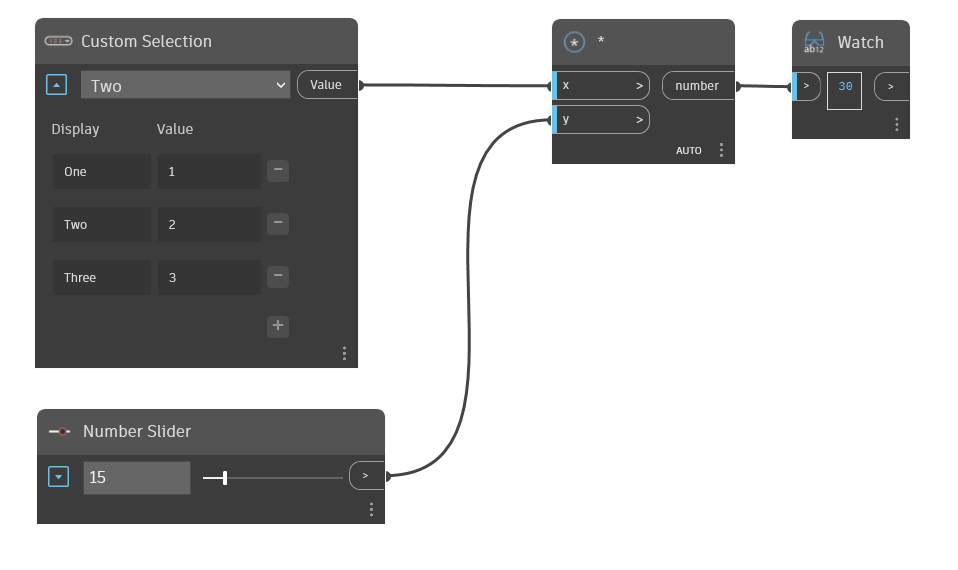

## Im Detail
Der Custom Dropdown-Block ermöglicht Benutzern das Erstellen einer Dropdown-Auswahleingabe mit benutzerdefinierten Beschriftungen und Werten. Wenn alle Werte Zahlen sind, ist die Ausgabe ein double-Wert, und wenn alle Werte Ganzzahlen sind, ist die Ausgabe eine Ganzzahl. Im folgenden Beispiel wurde Two im Custom Dropdown Menu-Block ausgewählt, sodass die Ausgabe dieses Blocks die Ganzzahl `2` ist.
___
## Beispieldatei

