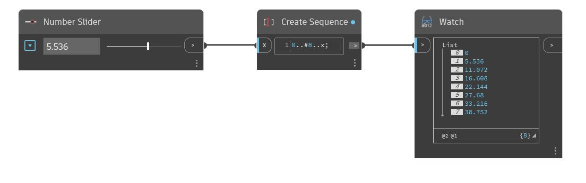

## Im Detail
Number Slider ist ein anpassbarer, taktiler Block, der eine Schnittstelle mit den Daten ermöglicht, die die Dynamo-Definitionen steuern. Hier wird Number Slider mit einem Codeblock gekoppelt, um eine dynamische Listenfolge mit variabler Schrittgröße zu erstellen.
___
## Beispieldatei

