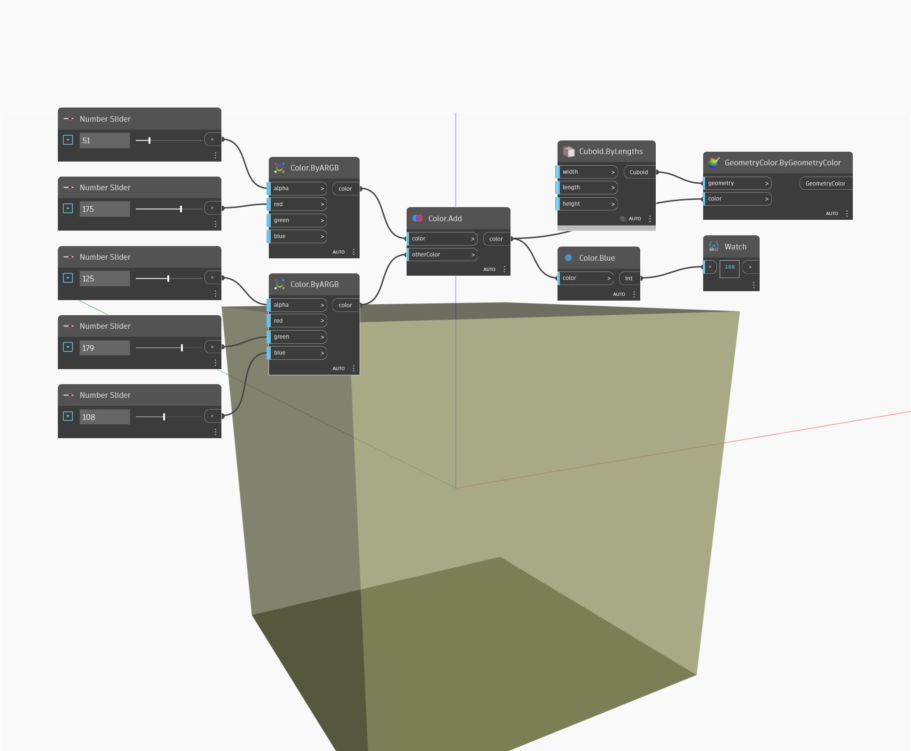

## Im Detail
Blue gibt den Blau-Wert einer Eingabefarbe im Bereich von 0 bis 255 zurück. Im folgenden Beispiel werden mithilfe von ByARGB-Blöcken zwei Farben erstellt und dann die beiden Farben kombiniert. Der Blau-Wert der resultierenden Farbe wird mithilfe eines Blue-Blocks ermittelt.
___
## Beispieldatei

