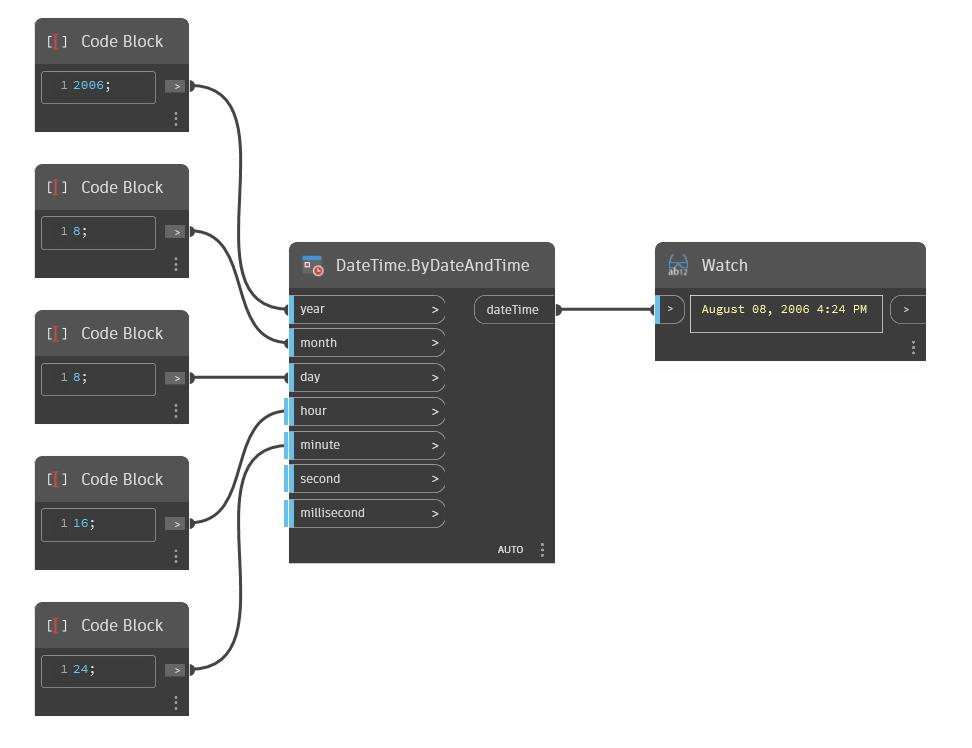

## In Depth
ByDateAndTime will return a dateTime from year, month, day, hour, minute, second, and millisecond inputs. In the example below, a new dateTime of August 08, 2006 4:24PM is created from those respective inputs.
___
## Example File

