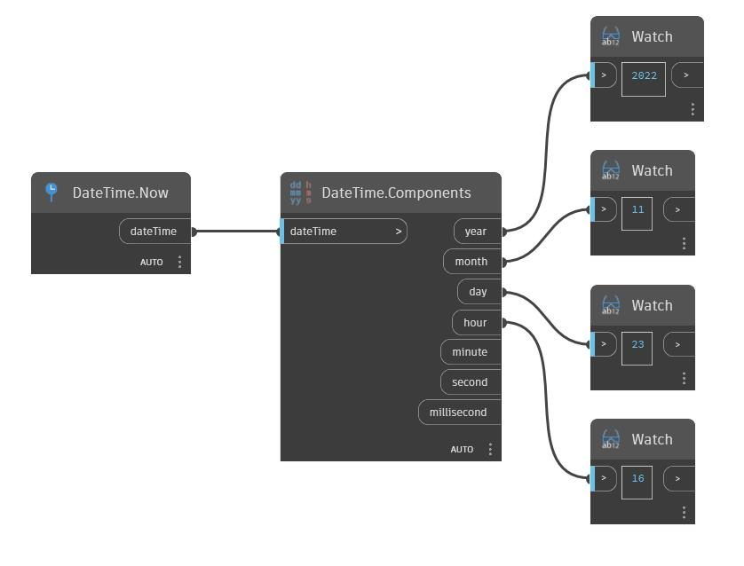

## Im Detail
Components gibt die Tage, Stunden, Minuten usw. eines TimeSpan-Werts zurück. Im folgenden Beispiel gibt ein TimeSpan-Wert von 5:16:21 0 Tage, 5 Stunden, 6 Minuten, 21 Sekunden und 0 Millisekunden zurück.
___
## Beispieldatei

