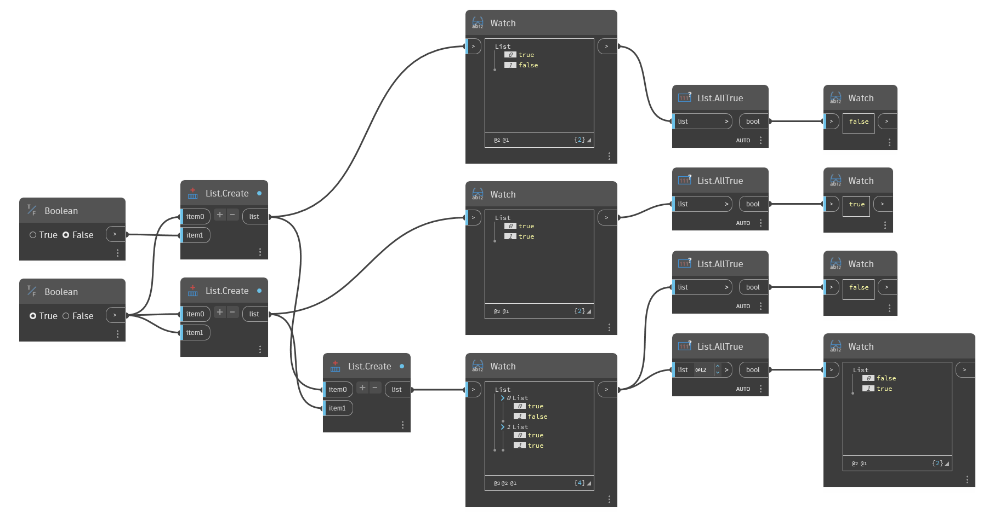

## Im Detail
`List.AllTrue` gibt False zurück, wenn ein Element in der angegebenen Liste False lautet oder kein boolescher Wert ist. `List.AllTrue` gibt nur True zurück, wenn jedes Element in der angegebenen Liste ein boolescher Wert ist und True lautet.

Im folgenden Beispiel wird `List.AllTrue` verwendet, um Listen mit booleschen Werten auszuwerten. Die erste Liste weist den Wert False auf, daher wird False zurückgegeben. Die zweite Liste weist nur True-Werte auf, daher wird True zurückgegeben. Die dritte Liste enthält eine Unterliste, die den Wert False aufweist, daher wird False zurückgegeben. Der letzte Block wertet die beiden Unterlisten aus und gibt False für die erste Liste zurück, da sie den Wert False enthält. Für die zweite Unterliste wird True zurückgegeben, da sie nur True-Werte enthält.
___
## Beispieldatei

