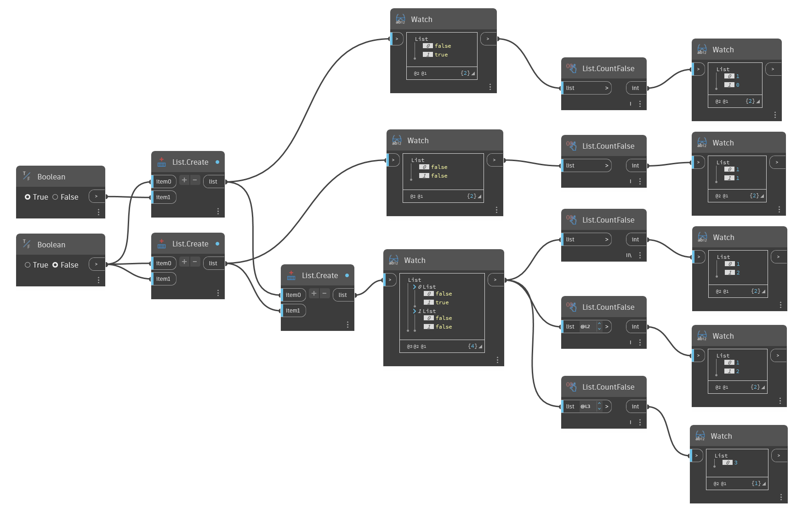

## Im Detail
`List.CountFalse` gibt die Anzahl der booleschen False-Werte in der Eingabeliste bzw. den Eingabelisten zurück.

Im folgenden Beispiel wird `List.CountFalse` verwendet, um die Anzahl der False-Werte in mehreren booleschen Listen zurückzugeben.
___
## Beispieldatei

