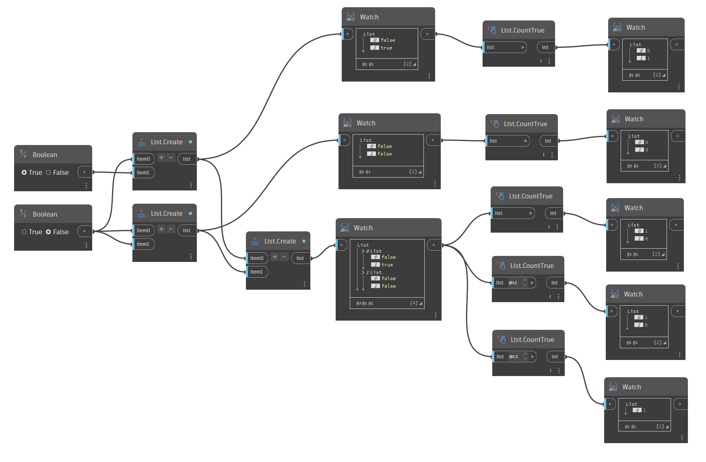

## Im Detail
`List.CountTrue` gibt die Anzahl der booleschen True-Werte in der Eingabeliste bzw. den Eingabelisten zurück.

Im folgenden Beispiel wird `List.CountTrue` verwendet, um die Anzahl der True-Werte in Listen mit booleschen Werten zurückzugeben.

___
## Beispieldatei

