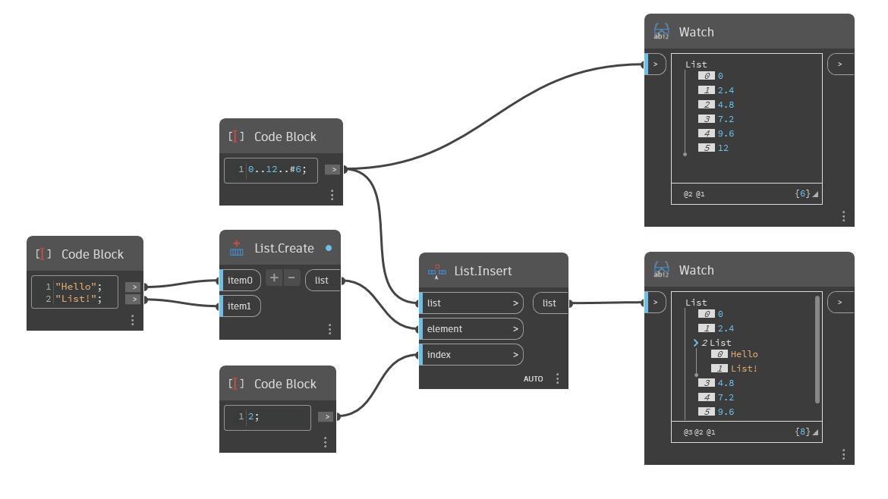

## Im Detail
`List.Insert` fügt mehrere Elemente an einem bestimmten Index in eine Liste ein.

Im folgenden Beispiel wird eine Liste mit den beiden Zeichenfolgen "Hello" und "List!" als Unterliste bei Indexwert 2 eingefügt. Dadurch entsteht eine neue Liste, die einen Index länger ist als die ursprüngliche Liste.

___
## Beispieldatei

