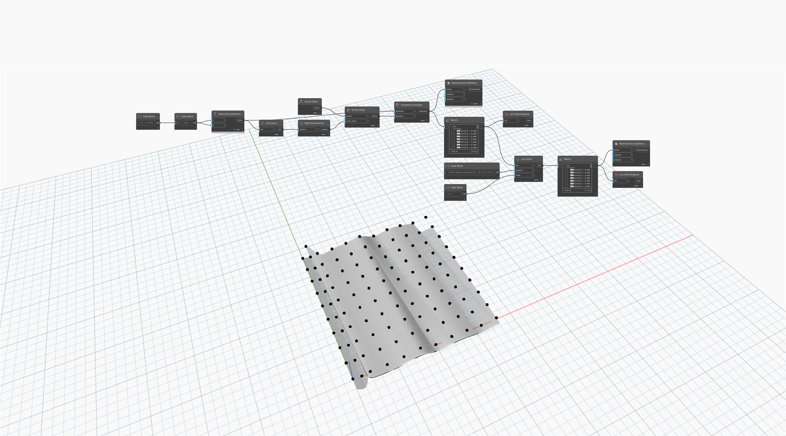

## Im Detail
`List.IsRectangular` gibt einen booleschen Wert zurück, der davon abhängig ist, ob die Zeilen einer Liste dieselbe Anzahl von Elementen aufweisen.

Im folgenden Beispiel wird der Wert False für ein Raster mit Punkten zurückgegeben, bei dem ein zusätzlicher Punkt zu einer Zeile hinzugefügt wurde. Aus einer unregelmäßigen Punktsammlung kann ein NurbsSurface-Objekt erstellt werden, es verhält sich jedoch möglicherweise nicht wie erwartet.
___
## Beispieldatei

