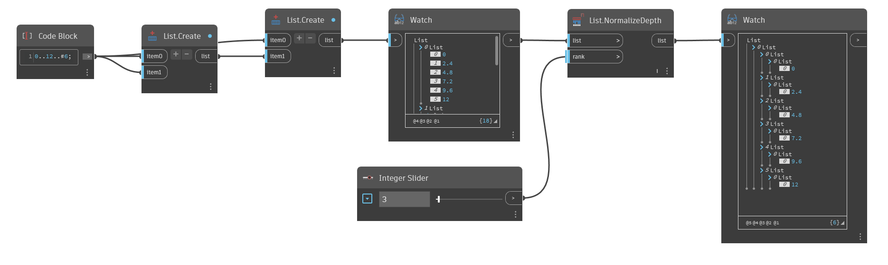

## Im Detail
`List.NormalizeDepth` gibt eine neue Liste einheitlicher Tiefe in einem bestimmten Rang oder einer bestimmten Listentiefe zurück.

Wie `List.Flatten` können Sie auch `List.NormalizeDepth` verwenden, um eine eindimensionale Liste (eine Liste mit einer einzigen Ebene) zurückzugeben. Sie können den Block jedoch auch verwenden, um Listenebenen hinzuzufügen. Der Block normalisiert die Eingabeliste auf eine Tiefe Ihrer Wahl.

Im folgenden Beispiel kann eine Liste mit 2 Listen ungleicher Tiefe mit einem Ganzzahlen-Schieberegler in verschiedene Ränge normalisiert werden. Durch Normalisieren der Tiefen in verschiedenen Rängen wird die Tiefe der Liste vergrößert oder verkleinert, bleibt jedoch immer einheitlich. Eine Liste mit Rang 1 gibt eine einzelne Liste mit Elementen zurück, während eine Liste mit Rang 3 zwei Ebenen mit Unterlisten zurückgibt.
___
## Beispieldatei

