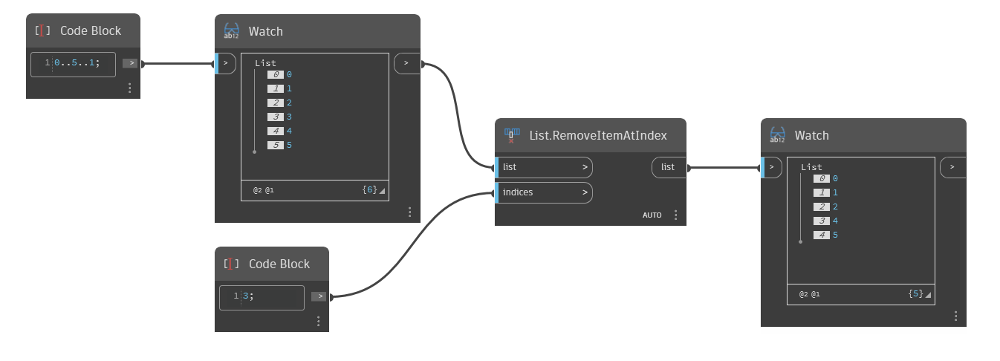

## Im Detail
`List.RemoveItemAtIndex` entfernt Elemente aus einer Eingabeliste an einem bestimmten Index bzw. Indizes.

Im folgenden Beispiel wird mit einem Zahlenbereich von 0 bis 5 begonnen. Anschließend wird das Element mit Index 3 entfernt.
___
## Beispieldatei

