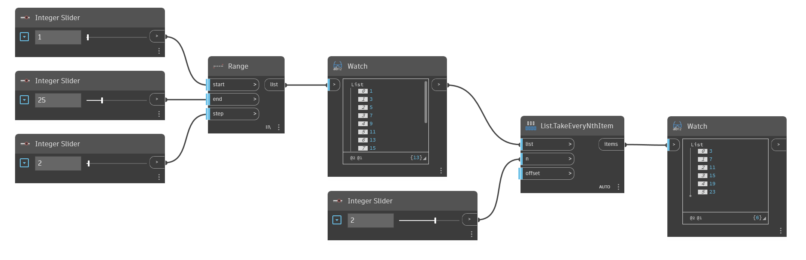

## Im Detail
`List.TakeEveryNthItem` erstellt eine neue Liste, die nur die Elemente aus der Eingabeliste enthält, die sich an Intervallen des eingegebenen n-Werts befinden. Der Startpunkt des Intervalls kann mit der `offset`-Eingabe geändert werden. Bei Eingabe von 3 in n und Beibehalten des Versatzes als Vorgabe von 0 bleiben Elemente mit den Indizes 2, 5, 8 usw. erhalten. Bei einem Versatz von 1 werden Elemente mit den Indizes 0, 3, 6 usw. beibehalten. Beachten Sie, dass der Versatz für die gesamte Liste gilt. Informationen zum Entfernen ausgewählter Elemente, statt diese beizubehalten, finden Sie unter `List.DropEveryNthItem`.

Im folgenden Beispiel wird zunächst mithilfe von `Range` eine Liste mit Zahlen generiert. Jede zweite Zahl wird dann beibehalten, indem 2 als Eingabe für n verwendet wird.
___
## Beispieldatei

