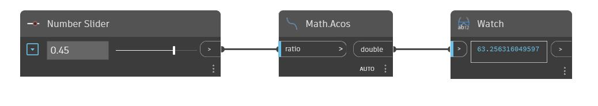

## Im Detail
Acos gibt den umgekehrten Kosinus, auch ArcCosinus genannt, einer eingegebenen Zahl zwischen -1 und 1 zurück. Dieser Ausgabewinkel wird in Grad zurückgegeben. Im folgenden Beispiel verwenden Sie einen auf den Bereich -1 bis 1 eingestellter Zahlen-Schieberegler, um die Eingabe für einen Acos-Block zu steuern.
___
## Beispieldatei

