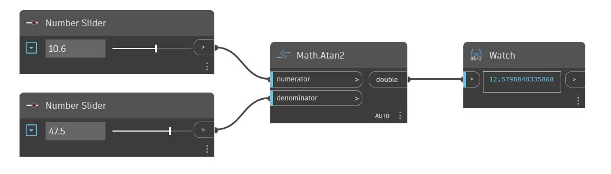

## Im Detail
Atan2 gibt den Arkustangens, auch als ArcTangen bezeichnet, des Verhältnisses eines eingegebenen Zählers und Nenners zurück. Dieser Ausgabewinkel wird in Grad zurückgegeben. Im folgenden Beispiel werden zwei Zahlen-Schieberegler verwendet, um die Eingabe für einen Atan2-Block zu steuern.
___
## Beispieldatei

