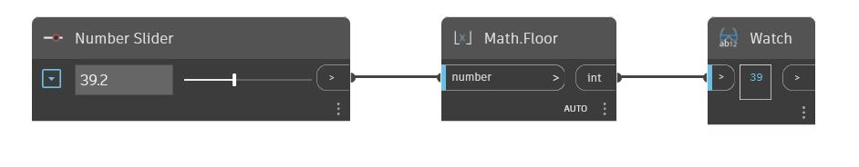

## Im Detail
Floor ermittelt die nächste Ganzzahl, die kleiner ist als eine eingegebene Zahl. Dies kann auch als Abrunden auf die nächste Ganzzahl betrachtet werden. Im folgenden Beispiel verwenden Sie einen Zahlen-Schieberegler, um die Eingabe für einen Floor-Block zu steuern.
___
## Beispieldatei

