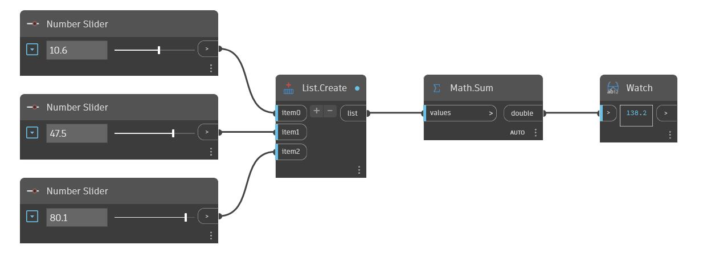

## Im Detail
Sum ermittelt die Summe der Werte einer Eingabeliste. Im folgenden Beispiel verwenden Sie drei Zahlen-Schieberegler, um drei Zahlen zu erstellen. Anschließend verwenden Sie einen List.Create-Block, um sie zu einer Liste zu kombinieren, die als Eingabe für einen Sum-Block verwendet werden kann.
___
## Beispieldatei

