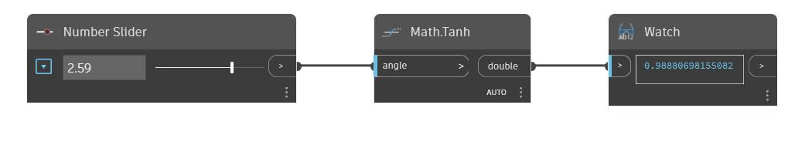

## Im Detail
Tanh gibt den hyperbolischen Tangens eines Eingabewinkels im Bogenmaß zurück. Im folgenden Beispiel verwenden Sie einen auf den Bereich -6.28 bis 6.28 eingestellten Zahlen-Schieberegler, um den Eingabewinkel für einen Tanh-Block zu steuern.
___
## Beispieldatei

