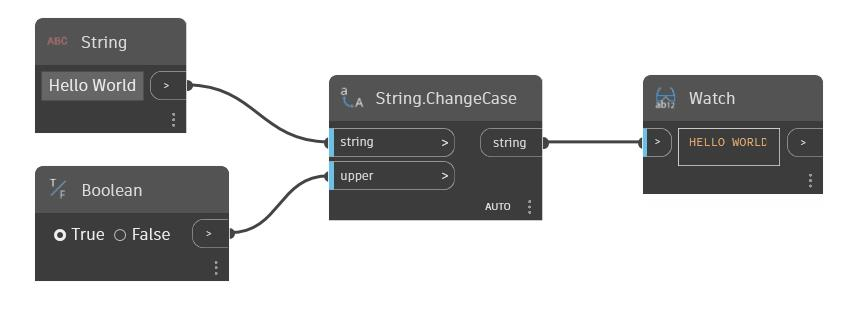

## Im Detail
Change Case verwendet eine Zeichenfolge und einen booleschen Wert als Eingabe. Wenn die boolesche Eingabe true lautet, wird die Eingabezeichenfolge in Großbuchstaben geändert. Wenn die boolesche Eingabe false lautet, wird die Eingabezeichenfolge in Kleinbuchstaben geändert. Im folgenden Beispiel wird die Beispielzeichenfolge Hello World als Eingabezeichenfolge verwendet, und ein boolescher Schalter gibt an, ob die Zeichenfolge in Großbuchstaben oder Kleinbuchstaben geändert werden soll.
___
## Beispieldatei

