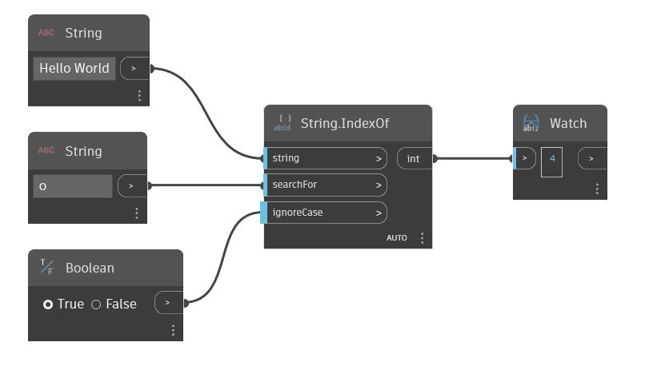

## Im Detail
IndexOf durchsucht eine bestimmte Zeichenfolge nach einer zweiten Eingabezeichenfolge. Wenn die zweite Zeichenfolge gefunden wird, gibt dieser Block den Index des ersten Zeichens des ersten Auftretens der Zeichenfolge zurück. Vorgabemäßig wird bei diesem Block die Groß-/Kleinschreibung beachtet. Ein boolescher Wert kann in der Eingabe ignoreCase verwendet werden, damit der Block die Groß-/Kleinschreibung der Zeichenfolgen ignoriert. Im folgenden Beispiel wird die Zeichenfolge Hello World verwendet und nach dem Zeichen o gesucht. Dieser Buchstabe tritt in der Zeichenfolge zweimal auf, aber nur der Index des ersten Vorkommens wird vom IndexOf-Block zurückgegeben.
___
## Beispieldatei

