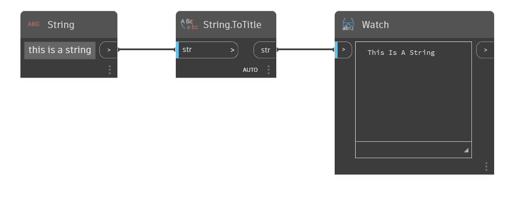

## Im Detail
String.ToTitle konvertiert die Eingabezeichenfolge in eine Zeichenfolge mit großen Anfangsbuchstaben. Bei Zeichenfolgen mit großen Anfangsbuchstaben handelt es sich um eine Variante von Zeichenfolgen, bei denen immer der erste Buchstabe in Großbuchstaben geschrieben wird.
___
## Beispieldatei

