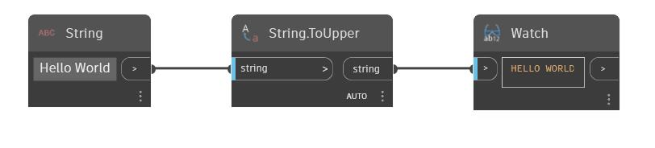

## Im Detail
To Upper konvertiert eine Eingabezeichenfolge in Großbuchstaben. Im folgenden Beispiel wird mit der Zeichenfolge Hello World begonnen. Mit einem ToUpper-Block ändern Sie diese Zeichenfolge in HELLO WORLD.
___
## Beispieldatei

